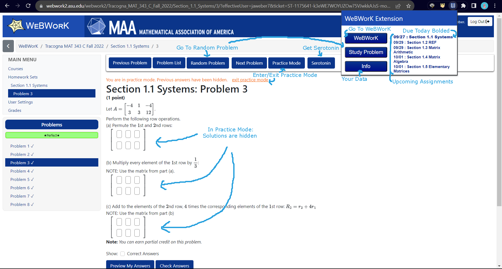
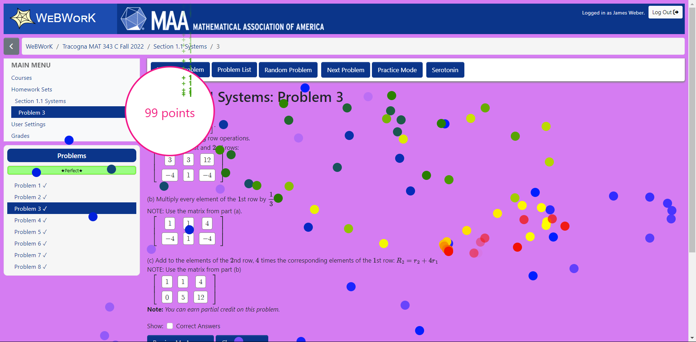

# Webwork_Extension

[video explaining how v1.0.0 (old version) works](https://www.youtube.com/watch?v=ZM0b95lquso)

## Shortcuts:
| Keys              |   Behavior            |
| :---------------- | :-------------------- |
| Shift + N         | Next Problem          |
| Shift + B         | Previous Problem      |
| Enter             | Submit Answers (or Next problem if answers have already been submitted, and are all correct)
| Shift + R         | Random Problem      |

## Other Features:

1. A button labeled "Random Problem" that appears on the button navbar next to the "Problem List" button, while working on a set. This button will take you to a random problem within the set.
2. A button labeled "Practice Mode" that appears on the button navbar while working on a set. This button will hide all previous or correct answers so you can redo problems without having their solutions spoiled for you.
3. A button labeled "Serotonin" that appears on the button navbar while working on a set. If your math homework is feeling especially dry, this button will give you a short burst of serotonin.
4. Colored text to warn you if you are low on attempts for a problem.
5. A button labeled "WeBWorK" that appears in the drop-down of the plugin up in the bookmarks bar that takes you to webwork.
6. A button labeled "Study Problem" that appears in the drop-down of the plugin up in the bookmarks bar. This button will take you to a random problem in a random set. It is designed to help study for multi-section exams.
7. Reminders for upcoming homework sets in the drop-down of the plugin up in bookmarks bar that will take you to each respective set by clicking on them. To set this up, click "Add <classname> to Classlist" on each of your classes' webwork pages.

## Set-up

Just watch from 2:18 to 4:10 in [this video](https://www.youtube.com/watch?v=ZM0b95lquso&t=138), and follow along.

#### Serotonin

